# Add factory eval schemas and tighten planner/quick validation

PR #2 in modernagencysales/fabro-maestro — closed — by timkeeeeeen — [https://github.com/modernagencysales/fabro-maestro/pull/2](https://github.com/modernagencysales/fabro-maestro/pull/2)

This improves factory measurability by adding missing eval contracts and making preflight validation enforce them. It also makes the planner output structurally checkable and removes a misleading machine-local workflow path.

### What changed and why
- Added two missing eval schemas:
  - `.fabro/evals/schemas/spec-eval.schema.json`
  - `.fabro/evals/schemas/release-readiness.schema.json`
  These establish explicit JSON output contracts for spec scoring and release-readiness decisions.
- Expanded `.fabro/scripts/factory-validate.sh --quick` to:
  - require `.factory/self/plan.md` (with an opt-out via `FACTORY_VALIDATE_ALLOW_MISSING_PLAN=1`), and
  - require all six expected eval schemas and validate they are parseable JSON.
  This catches missing/malformed contract files early instead of allowing silent drift.
- Updated `workflow.fabro` preflight to set `FACTORY_VALIDATE_ALLOW_MISSING_PLAN=1` so pre-plan runs still pass intentionally.
- Strengthened `.fabro/prompts/factory/planner.md` with an explicit four-section output contract and prioritization rules, so `goal_gate=true` has concrete structure to enforce.
- Removed the hardcoded local `working_dir` from `.fabro/workflows/factory-self-improve/workflow.toml` to avoid environment-specific confusion.

### Plan Summary
- Added the missing `spec-eval` and `release-readiness` schemas defined by the factory design.
- Wired quick validation to enforce planner artifact presence and eval schema existence/JSON validity.
- Tightened planner prompt output requirements and cleaned workflow config by removing a developer-local path.

Note: this PR also includes run artifacts under `.factory/` (plan/reviews/validation outputs) produced by the workflow execution.

<details>
<summary>Full plan</summary>

````md
All three patches applied and validated. Here is the full plan summary:

---

## Plan Summary

### Current Factory Gaps (8 identified)

| # | Gap | Severity |
|---|-----|----------|
| 1 | Missing `spec-eval.schema.json` and `release-readiness.schema.json` | HIGH |
| 2 | `factory-validate.sh --quick` doesn't check eval schemas exist/are valid JSON | HIGH |
| 3 | Planner prompt has no explicit output contract (goal gate fires on any output) | MEDIUM |
| 4 | No `factory-retro.schema.json` or `maestro-retro.fabro` workflow | MEDIUM |
| 5 | `workflow.toml` has hardcoded local `/Users/ajmal/...` path | LOW |
| 6 | Scope guard doesn't verify reviewer output files were actually written | MEDIUM |
| 7 | Missing migration/performance/observability reviewer prompts (3 of 6) | LOW |
| 8 | No `detect-risk-surfaces.sh` script (used by risk classifier + scope guard) | LOW |

---

### Three Patches Implemented

**Patch 1 — Added two missing eval schemas**  
Created `.fabro/evals/schemas/spec-eval.schema.json` and `.fabro/evals/schemas/release-readiness.schema.json` from the design spec's §12.2 and §12.8 contracts. These define machine-checkable output contracts for the spec evaluator (8 scoring dimensions, overall_score ≥ 4.0 to pass) and the release readiness stage (blockers, rollback plan, manual QA steps). Factory now has 6 complete eval schemas.

**Patch 2 — Wired schema presence+validity into `factory-validate.sh --quick`**  
Added an "eval schema checks" block to the quick preflight path. It asserts all 6 required schemas exist and are valid JSON (using Python's `json.load`). Any missing or malformed schema now causes a hard preflight failure, so silent schema drift is caught before the implement stage begins.

**Patch 3 — Strengthened planner prompt + removed hardcoded local path**  
The planner prompt now specifies four required sections (`## Current Factory Gaps`, `## First Three Patches`, `## Validation Commands`, `## Risks and Guardrails`) with explicit content rules. The `goal_gate=true` on the plan node now has structural meaning. Separately, the hardcoded `working_dir = "/Users/ajmal/Maestro/fabro-maestro"` was removed from `workflow.toml` — it was a developer-local artefact that was ignored by Daytona but confusing to read.

**Validation:** `.fabro/scripts/factory-validate.sh --quick` passes with all 6 schemas confirmed valid.
````

</details>

### Fabro Details

<details>
<summary>Ran 12 stages in 23m 21s for $2.05</summary>

| Stage | Duration | Cost | Retries |
|---|---|---|---|
| start | 0s | – | 0 |
| preflight | 1s | – | 0 |
| plan | 3m 22s | $0.84 | 0 |
| implement | 2m 23s | $0.37 | 0 |
| scope_guard | 2s | – | 0 |
| validate | 10m 16s | – | 0 |
| fix_validation | 3m 57s | $0.17 | 0 |
| review_fanout | 1m 53s | $0.49 | 0 |
| merge_reviews | 0s | – | 0 |
| consolidate_reviews | 50s | $0.18 | 0 |
| release_notes | 0s | – | 0 |
| open_pr | 1s | – | 0 |
| **Total** | **23m 21s** | **$2.05** | **0** |

```dot
digraph FactorySelfImprove {
  graph [
    goal="Improve the Fabro software factory inside modernagencysales/fabro-maestro. Do not work on Maestro V2.",
    rankdir=LR,
    default_fidelity="summary:high",
    max_node_visits=10,
    stall_timeout="7200s",
    model_stylesheet="
      *          { model: gpt-5-mini; reasoning_effort: medium; }
      .coding    { model: gpt-5.3-codex; reasoning_effort: high; }
      .architect { model: claude-sonnet-4-6; reasoning_effort: high; }
      .critic    { model: gemini-3.1-pro-preview; reasoning_effort: high; }
      .docs      { model: claude-haiku-4-5; reasoning_effort: none; }
    "
  ]

  start [shape=Mdiamond, label="Start"]
  exit  [shape=Msquare, label="Exit"]

  preflight [
    label="Factory Preflight",
    shape=parallelogram,
    goal_gate=true,
    retry_target="implement",
    script="set -euo pipefail; remote=$(git remote get-url origin); origin_safe=$(printf '%s' \"$remote\" | sed -E 's#(https://x-access-token:)[^@]+@#\\1REDACTED@#; s#(https://)[^/@:]+:[^@]+@#\\1REDACTED@#'); echo \"origin=${origin_safe}\"; case \"$remote\" in *modernagencysales/fabro-maestro*|*fabro-sh/fabro*) ;; *) echo \"FAIL: expected fabro-maestro/fabro origin\"; exit 1;; esac; test -f docs/factory/maestro-fabro-perfect-software-factory.md; .fabro/scripts/factory-validate.sh --quick"
  ]

  plan [
    label="Plan Factory Slice",
    class="architect",
    fidelity="summary:high",
    prompt="@../../prompts/factory/planner.md",
    goal_gate=true,
    retry_target="plan"
  ]

  implement [
    label="Implement Factory Slice",
    class="coding",
    fidelity="full",
    thread_id="factory-implementation",
    prompt="@../../prompts/factory/implementer.md"
  ]

  scope_guard [
    label="Scope Guard",
    shape=parallelogram,
    goal_gate=true,
    retry_target="implement",
    script=".fabro/scripts/factory-scope-guard.sh"
  ]

  validate [
    label="Validate Factory",
    shape=parallelogram,
    goal_gate=true,
    retry_target="fix_validation",
    script=".fabro/scripts/factory-validate.sh"
  ]

  fix_validation [
    label="Fix Validation",
    class="coding",
    fidelity="full",
    thread_id="factory-implementation",
    max_visits=3,
    prompt="@../../prompts/factory/fixer.md"
  ]

  qa_review [
    label="QA Review",
    class="critic",
    fidelity="summary:high",
    prompt="@../../prompts/factory/qa-reviewer.md"
  ]

  security_review [
    label="Security Review",
    class="architect",
    fidelity="summary:high",
    prompt="@../../prompts/factory/security-reviewer.md"
  ]

  architecture_review [
    label="Architecture Review",
    class="architect",
    fidelity="summary:high",
    prompt="@../../prompts/factory/architecture-reviewer.md"
  ]

  review_fanout [
    label="Parallel Review Fan-out",
    shape=component,
    join_policy="wait_all",
    max_parallel=3
  ]

  merge_reviews [shape=tripleoctagon, label="Merge Review Results"]

  consolidate_reviews [
    label="Consolidate Reviews",
    class="architect",
    fidelity="summary:high",
    prompt="@../../prompts/factory/consolidate-reviews.md",
    goal_gate=true,
    retry_target="fix_review_findings"
  ]

  fix_review_findings [
    label="Fix Review Findings",
    class="coding",
    fidelity="full",
    thread_id="factory-implementation",
    max_visits=2,
    prompt="Read .factory/reviews/consolidated.md and fix only BLOCKER/HIGH factory findings. Do not edit Maestro V2. Re-run .fabro/scripts/factory-validate.sh --quick."
  ]

  release_notes [
    label="Release Notes",
    class="docs",
    fidelity="summary:medium",
    prompt="@../../prompts/factory/release.md"
  ]

  open_pr [
    label="Commit Push PR",
    shape=parallelogram,
    script="set -euo pipefail; find .factory -name '*.log' -delete 2>/dev/null || true; git status --short; git add -A; git reset -- .factory/self/validation.log 2>/dev/null || true; git -c user.email=ajmal@maestrogtm.com -c user.name=ajmal commit -m \"feat(factory): improve self-building factory\" || echo \"No uncommitted changes\"; branch=$(git branch --show-current); git push -u origin HEAD; repo_path=$(git remote get-url origin | sed -E 's#.*github.com[:/]([^/]+/[^/.]+)(\\.git)?$#\\1#'); body=.factory/release/release.md; test -f \"$body\" || body=README.md; if command -v gh >/dev/null 2>&1; then existing=$(gh pr list --repo \"$repo_path\" --head \"$branch\" --json url --jq '.[0].url' 2>/tmp/factory-pr.err || true); if [ -n \"$existing\" ]; then echo \"$existing\"; elif gh pr create --repo \"$repo_path\" --base main --head \"$branch\" --title \"feat(factory): improve self-building factory\" --body-file \"$body\" --draft; then true; else cat /tmp/factory-pr.err 2>/dev/null || true; echo \"WARN: PR helper failed after branch push; babysitter can create/link PR.\"; fi; else echo \"WARN: gh missing after branch push; babysitter can create/link PR.\"; fi"
  ]

  start -> preflight -> plan -> implement -> scope_guard -> validate
  validate -> fix_validation [condition="outcome=failed"]
  fix_validation -> scope_guard
  validate -> review_fanout
  review_fanout -> qa_review
  review_fanout -> security_review
  review_fanout -> architecture_review
  qa_review -> merge_reviews
  security_review -> merge_reviews
  architecture_review -> merge_reviews
  merge_reviews -> consolidate_reviews -> release_notes -> open_pr -> exit
  consolidate_reviews -> fix_review_findings [condition="outcome=failed"]
  fix_review_findings -> scope_guard
}

```

</details>

<details>
<summary>Ran <code>FactorySelfImprove.fabro</code> (17 nodes and 20 edges)</summary>



</details>

⚒️ Generated with [Fabro](https://fabro.sh)
