# Add retro workflow and expand build reviews to six reviewers

PR #1 in modernagencysales/maestro-factory — closed — by kimprobably — [https://github.com/modernagencysales/maestro-factory/pull/1](https://github.com/modernagencysales/maestro-factory/pull/1)

This PR closes two factory maturity gaps in a single additive update: it expands build-time review coverage to include performance and observability, and introduces a new retrospective workflow so completed runs can produce structured optimization inputs.

## Summary
- `maestro-build.fabro` now fans out to **six** parallel reviewers (QA, security, architecture, migration, performance, observability), with `max_parallel` updated to 6 and merge/consolidation wiring updated accordingly.
- Added new reviewer prompts:
  - `.fabro/prompts/build/performance-reviewer.md`
  - `.fabro/prompts/build/observability-reviewer.md`
- Extended `.fabro/evals/schemas/reviewer-finding.schema.json` to support new stages and IDs (`PERF-*`, `OBS-*`) and clarified `not_applicable` guidance.
- Added a full retro loop:
  - workflow: `.fabro/workflows/maestro-retro.fabro`
  - run config: `.fabro/runs/maestro-retro.toml`
  - prompts under `.fabro/prompts/retro/`
  - metrics loader: `scripts/collect-retro-metrics.sh`
  - output contract updates in `.fabro/prompts/shared/output-contracts.md`
  - docs updates in `README.md`

## Why this approach
The build-review expansion is low-risk and directly improves defect detection breadth without changing existing reviewer behavior. The retro workflow is intentionally linear and artifact-driven (collect → analyze → propose → calibrate → validate), so it can be introduced safely as a post-run loop with deterministic output checks before exit.

### Plan Summary
- Add performance and observability as first-class build reviewers.
- Update shared reviewer finding schema for new stages/ID prefixes.
- Introduce a dedicated retrospective workflow, prompts, and run config.
- Generate deterministic retro metrics from parent run artifacts.
- Document retro artifacts and updated workflow topology in repository docs.

<details>
<summary>Full plan</summary>

````md
All validated. Here is a complete summary of what was done:

---

## Plan Written + Slice Implemented

### `.factory/self/plan.md` — Written

The plan documents **10 maturity gaps** between the current factory and the perfect-factory design, and selects the next concrete slice.

---

### Selected Slice: Add Performance + Observability Reviewers (P2 + P3 + P4)

**Why this slice:** The perfect-factory design §4.2 explicitly calls for a 6-way parallel review fan-out. The current `maestro-build.fabro` only had 4 reviewers. This is one of the clearest, most measurable gaps — and it's purely additive (zero risk of breaking existing behavior).

**Three files changed, two files created:**

| File | Change |
|---|---|
| `.fabro/evals/schemas/reviewer-finding.schema.json` | Extended `stage` enum to add `"performance"` and `"observability"`; extended `id` pattern to allow `PERF-NNN` and `OBS-NNN` |
| `.fabro/prompts/build/performance-reviewer.md` | **New** — independent reviewer prompt covering unbounded queries, await waterfalls, over-fetching, caching gaps, Lighthouse regressions |
| `.fabro/prompts/build/observability-reviewer.md` | **New** — independent reviewer prompt covering silent failures, secret-bearing logs, missing audit events, trace coverage gaps |
| `.fabro/workflows/maestro-build.fabro` | Added 2 reviewer nodes, increased `max_parallel` from 4 → 6, wired both to `merge` node |

**Validation:** `scripts/factory-validate.sh --quick` → `validation_passed_quick` ✅

**Committed and pushed** to `fabro/run/01KS79SWN2RJW1DY81V58E7KTE` as commit `2260c68`.

---

### Next Slice (after this merges): Retrospective Workflow

The highest remaining gap is **property #8 "Optimizable"** — creating `maestro-retro.fabro` + `prompts/retro/` + `.fabro/runs/maestro-retro.toml` so every run can feed a structured retrospective loop.
````

</details>

### Fabro Details

<details>
<summary>Ran 10 stages in 16m 11s for $3.37</summary>

| Stage | Duration | Cost | Retries |
|---|---|---|---|
| start | 0s | – | 0 |
| preflight | 1s | – | 0 |
| plan | 4m 39s | $1.54 | 0 |
| implement | 6m 8s | $0.77 | 0 |
| validate | 1s | – | 0 |
| review_fanout | 2m 5s | $0.41 | 0 |
| merge_reviews | 0s | – | 0 |
| consolidate_reviews | 2m 57s | $0.65 | 0 |
| release_notes | 0s | – | 0 |
| open_pr | 1s | – | 0 |
| **Total** | **16m 11s** | **$3.37** | **0** |

```dot
digraph FactorySelfImprove {
  graph [
    goal="Improve modernagencysales/maestro-factory until it is a reliable, measurable, self-improving software factory.",
    rankdir=LR,
    default_fidelity="summary:high",
    max_node_visits=8,
    stall_timeout="7200s",
    model_stylesheet="
      *          { model: gpt-5-mini; reasoning_effort: medium; }
      .coding    { model: gpt-5.3-codex; reasoning_effort: high; }
      .architect { model: claude-sonnet-4-6; reasoning_effort: high; }
      .critic    { model: gemini-3.1-pro-preview; reasoning_effort: high; }
      .docs      { model: claude-haiku-4-5; reasoning_effort: none; }
    "
  ]

  start [shape=Mdiamond, label="Start"]
  exit  [shape=Msquare, label="Exit"]

  preflight [
    label="Factory Preflight",
    shape=parallelogram,
    goal_gate=true,
    retry_target="fix_validation",
    script="scripts/factory-validate.sh --quick"
  ]

  plan [
    label="Plan Next Slice",
    class="architect",
    fidelity="summary:high",
    prompt="@../prompts/factory-self/plan.md",
    goal_gate=true,
    retry_target="plan"
  ]

  implement [
    label="Implement Slice",
    class="coding",
    fidelity="full",
    thread_id="factory-self",
    prompt="@../prompts/factory-self/implement.md"
  ]

  validate [
    label="Validate Factory",
    shape=parallelogram,
    goal_gate=true,
    retry_target="fix_validation",
    script="scripts/factory-validate.sh"
  ]

  fix_validation [
    label="Fix Validation",
    class="coding",
    fidelity="full",
    thread_id="factory-self",
    max_visits=3,
    prompt="@../prompts/factory-self/fix-validation.md"
  ]

  review_fanout [
    label="Parallel Reviews",
    shape=component,
    join_policy="wait_all",
    max_parallel=3
  ]

  qa_review [
    label="QA Review",
    class="critic",
    fidelity="summary:high",
    prompt="@../prompts/factory-self/qa-review.md"
  ]

  security_review [
    label="Security Review",
    class="architect",
    fidelity="summary:high",
    prompt="@../prompts/factory-self/security-review.md"
  ]

  architecture_review [
    label="Architecture Review",
    class="architect",
    fidelity="summary:high",
    prompt="@../prompts/factory-self/architecture-review.md"
  ]

  merge_reviews [shape=tripleoctagon, label="Merge Reviews"]

  consolidate_reviews [
    label="Consolidate Reviews",
    class="architect",
    fidelity="summary:high",
    goal_gate=true,
    retry_target="fix_review_findings",
    prompt="@../prompts/factory-self/consolidate-reviews.md"
  ]

  fix_review_findings [
    label="Fix Review Findings",
    class="coding",
    fidelity="full",
    thread_id="factory-self",
    max_visits=2,
    prompt="@../prompts/factory-self/fix-review-findings.md"
  ]

  release_notes [
    label="Release Notes",
    class="docs",
    fidelity="summary:medium",
    prompt="@../prompts/factory-self/release-notes.md"
  ]

  open_pr [
    label="Commit Push Auto-Merge PR",
    shape=parallelogram,
    script="set -euo pipefail; find .factory -name '*.log' -delete 2>/dev/null || true; git status --short; git add -A; git reset -- sandbox/Dockerfile 2>/dev/null || true; git -c user.email=ajmal@maestrogtm.com -c user.name=ajmal commit -m \"feat(factory): improve self-building factory\" || echo \"No uncommitted changes\"; branch=$(git branch --show-current); git push -u origin HEAD; body=.factory/release/release.md; test -f \"$body\" || body=README.md; if command -v gh >/dev/null 2>&1; then existing=$(gh pr list --repo modernagencysales/maestro-factory --head \"$branch\" --json url --jq '.[0].url' 2>/tmp/factory-pr.err || true); if [ -n \"$existing\" ]; then echo \"$existing\"; pr=\"$existing\"; else pr=$(gh pr create --repo modernagencysales/maestro-factory --base main --head \"$branch\" --title \"feat(factory): improve self-building factory\" --body-file \"$body\" 2>/tmp/factory-pr.err || true); echo \"$pr\"; fi; if [ -n \"${pr:-}\" ]; then gh pr ready \"$pr\" --repo modernagencysales/maestro-factory 2>/dev/null || true; gh pr merge \"$pr\" --repo modernagencysales/maestro-factory --squash --delete-branch --auto 2>/tmp/factory-pr-merge.err || gh pr merge \"$pr\" --repo modernagencysales/maestro-factory --squash --delete-branch; else cat /tmp/factory-pr.err 2>/dev/null || true; echo \"WARN: PR helper failed after branch push; babysitter can create/link PR.\"; fi; else echo \"WARN: gh missing after branch push; babysitter can create/link PR.\"; fi"
  ]

  start -> preflight -> plan -> implement -> validate
  validate -> fix_validation [condition="outcome=failed"]
  fix_validation -> validate
  validate -> review_fanout
  review_fanout -> qa_review
  review_fanout -> security_review
  review_fanout -> architecture_review
  qa_review -> merge_reviews
  security_review -> merge_reviews
  architecture_review -> merge_reviews
  merge_reviews -> consolidate_reviews -> release_notes -> open_pr -> exit
  consolidate_reviews -> fix_review_findings [condition="outcome=failed"]
  fix_review_findings -> validate
}

```

</details>

<details>
<summary>Ran <code>FactorySelfImprove.fabro</code> (16 nodes and 19 edges)</summary>



</details>

⚒️ Generated with [Fabro](https://fabro.sh)

<!-- This is an auto-generated comment: release notes by coderabbit.ai -->
## Summary by CodeRabbit

* **New Features**
  * Added Performance and Observability review paths and expanded six-way parallel review in the build workflow
  * Added a retrospective workflow with run config and a metrics collection script for post-run analysis

* **Documentation**
  * Added prompts and output contract docs for performance, observability, and retro tasks
  * Updated README to describe the expanded workflows and retrospective loop

* **Chores**
  * Adjusted CI install step and run checkpoint exclusions for local runs

<!-- review_stack_entry_start -->

[](https://app.coderabbit.ai/change-stack/modernagencysales/maestro-factory/pull/1?utm_source=github_walkthrough&utm_medium=github&utm_campaign=change_stack)

<!-- review_stack_entry_end -->
<!-- end of auto-generated comment: release notes by coderabbit.ai -->
