# Align review and release evals with all six reviewer lanes

PR #2 in modernagencysales/maestro-factory — closed — by kimprobably — [https://github.com/modernagencysales/maestro-factory/pull/2](https://github.com/modernagencysales/maestro-factory/pull/2)

This fixes a measurement gap where performance and observability reviews were run but not consistently included in evaluation gates, making release quality signals incomplete.

The PR updates the factory contracts and prompts so all six reviewer lanes (qa, security, architecture, migration, performance, observability) are treated as first-class inputs across consolidation, reviewer usefulness scoring, and release readiness checks. In particular, `review-eval.schema.json` now requires both missing reviewer keys, consolidator/release/release-manager guidance now references all six lanes, and workflow inline eval prompts were moved to dedicated prompt files for `review-eval` and `release-eval` with explicit deterministic checks.

It also tightens the release scorecard by documenting the exact required `release.md` H2 headings, reducing ambiguity in deterministic validation.

<details>
<summary>Full plan</summary>

````md
All validation passes. Here is a summary of what was done:

---

## Selected Slice: Fix `review-eval.schema.json` to cover all 6 reviewers

### Problem identified
The build workflow (`maestro-build.fabro`) fans out to **6 parallel reviewers** (qa, security, architecture, migration, performance, observability), but `review-eval.schema.json` only required and scored **4** of them. Performance and observability reviewer lanes were structurally invisible — their findings were never quantitatively measured, breaking the **measurable** property of the perfect factory design (§22).

### Changes made

**`.fabro/evals/schemas/review-eval.schema.json`:**
- Updated `description` from "four reviewers" → "six reviewers"
- Added `performance_review` and `observability_review` to `required[]`
- Added `performance_review` and `observability_review` to `properties{}` with the same `$ref: reviewer_score` shape as the other four

**`.fabro/workflows/maestro-build.fabro`:**
- Updated the `review_eval` inline prompt to explicitly name all six reviewer keys that must appear in the emitted JSON

### Validation
- `jq empty` passes on the updated schema ✓
- `bash scripts/factory-validate.sh --quick` passes ✓
- `jq '.required | length'` → 7 (6 reviewers + `overall_quality`) ✓
- All 6 reviewer property keys confirmed present ✓

### Commit
`546c5a5` pushed to `fabro/run/01KS7C6K3NCM60Y4JYH8ANXW3B` on `modernagencysales/maestro-factory`. Fabro's GitHub integration will handle PR creation and auto-merge.
````

</details>

### Fabro Details

<details>
<summary>Ran 10 stages in 11m 54s for $2.05</summary>

| Stage | Duration | Cost | Retries |
|---|---|---|---|
| start | 0s | – | 0 |
| preflight | 1s | – | 0 |
| plan | 2m 51s | $0.92 | 0 |
| implement | 4m 12s | $0.54 | 0 |
| validate | 1s | – | 0 |
| review_fanout | 3m 39s | $0.48 | 0 |
| merge_reviews | 0s | – | 0 |
| consolidate_reviews | 49s | $0.12 | 0 |
| release_notes | 0s | – | 0 |
| open_pr | 1s | – | 0 |
| **Total** | **11m 54s** | **$2.05** | **0** |

```dot
digraph FactorySelfImprove {
  graph [
    goal="Improve modernagencysales/maestro-factory until it is a reliable, measurable, self-improving software factory.",
    rankdir=LR,
    default_fidelity="summary:high",
    max_node_visits=8,
    stall_timeout="7200s",
    model_stylesheet="
      *          { model: gpt-5-mini; reasoning_effort: medium; }
      .coding    { model: gpt-5.3-codex; reasoning_effort: high; }
      .architect { model: claude-sonnet-4-6; reasoning_effort: high; }
      .critic    { model: gemini-3.1-pro-preview; reasoning_effort: high; }
      .docs      { model: claude-haiku-4-5; reasoning_effort: none; }
    "
  ]

  start [shape=Mdiamond, label="Start"]
  exit  [shape=Msquare, label="Exit"]

  preflight [
    label="Factory Preflight",
    shape=parallelogram,
    goal_gate=true,
    retry_target="fix_validation",
    script="scripts/factory-validate.sh --quick"
  ]

  plan [
    label="Plan Next Slice",
    class="architect",
    fidelity="summary:high",
    prompt="@../prompts/factory-self/plan.md",
    goal_gate=true,
    retry_target="plan"
  ]

  implement [
    label="Implement Slice",
    class="coding",
    fidelity="full",
    thread_id="factory-self",
    prompt="@../prompts/factory-self/implement.md"
  ]

  validate [
    label="Validate Factory",
    shape=parallelogram,
    goal_gate=true,
    retry_target="fix_validation",
    script="scripts/factory-validate.sh"
  ]

  fix_validation [
    label="Fix Validation",
    class="coding",
    fidelity="full",
    thread_id="factory-self",
    max_visits=3,
    prompt="@../prompts/factory-self/fix-validation.md"
  ]

  review_fanout [
    label="Parallel Reviews",
    shape=component,
    join_policy="wait_all",
    max_parallel=3
  ]

  qa_review [
    label="QA Review",
    class="critic",
    fidelity="summary:high",
    prompt="@../prompts/factory-self/qa-review.md"
  ]

  security_review [
    label="Security Review",
    class="architect",
    fidelity="summary:high",
    prompt="@../prompts/factory-self/security-review.md"
  ]

  architecture_review [
    label="Architecture Review",
    class="architect",
    fidelity="summary:high",
    prompt="@../prompts/factory-self/architecture-review.md"
  ]

  merge_reviews [shape=tripleoctagon, label="Merge Reviews"]

  consolidate_reviews [
    label="Consolidate Reviews",
    class="architect",
    fidelity="summary:high",
    goal_gate=true,
    retry_target="fix_review_findings",
    prompt="@../prompts/factory-self/consolidate-reviews.md"
  ]

  fix_review_findings [
    label="Fix Review Findings",
    class="coding",
    fidelity="full",
    thread_id="factory-self",
    max_visits=2,
    prompt="@../prompts/factory-self/fix-review-findings.md"
  ]

  release_notes [
    label="Release Notes",
    class="docs",
    fidelity="summary:medium",
    prompt="@../prompts/factory-self/release-notes.md"
  ]

  open_pr [
    label="Commit Push Auto-Merge PR",
    shape=parallelogram,
    script="set -euo pipefail; find .factory -name '*.log' -delete 2>/dev/null || true; body=.factory/release/release.md; test -f \"$body\" || body=README.md; body_copy=/tmp/factory-release.md; cp \"$body\" \"$body_copy\"; git rm -r --cached .factory 2>/dev/null || true; rm -rf .factory; git status --short; git add -A; git reset -- sandbox/Dockerfile 2>/dev/null || true; git -c user.email=ajmal@maestrogtm.com -c user.name=ajmal commit -m \"feat(factory): improve self-building factory\" || echo \"No uncommitted changes\"; branch=$(git branch --show-current); git push -u origin HEAD; if command -v gh >/dev/null 2>&1; then existing=$(gh pr list --repo modernagencysales/maestro-factory --head \"$branch\" --json url --jq '.[0].url' 2>/tmp/factory-pr.err || true); if [ -n \"$existing\" ]; then echo \"$existing\"; pr=\"$existing\"; else pr=$(gh pr create --repo modernagencysales/maestro-factory --base main --head \"$branch\" --title \"feat(factory): improve self-building factory\" --body-file \"$body_copy\" 2>/tmp/factory-pr.err || true); echo \"$pr\"; fi; if [ -n \"${pr:-}\" ]; then gh pr ready \"$pr\" --repo modernagencysales/maestro-factory 2>/dev/null || true; gh pr merge \"$pr\" --repo modernagencysales/maestro-factory --squash --delete-branch --auto 2>/tmp/factory-pr-merge.err || gh pr merge \"$pr\" --repo modernagencysales/maestro-factory --squash --delete-branch; else cat /tmp/factory-pr.err 2>/dev/null || true; echo \"WARN: PR helper failed after branch push; babysitter can create/link PR.\"; fi; else echo \"WARN: gh missing after branch push; babysitter can create/link PR.\"; fi"
  ]

  start -> preflight -> plan -> implement -> validate
  validate -> fix_validation [condition="outcome=failed"]
  fix_validation -> validate
  validate -> review_fanout
  review_fanout -> qa_review
  review_fanout -> security_review
  review_fanout -> architecture_review
  qa_review -> merge_reviews
  security_review -> merge_reviews
  architecture_review -> merge_reviews
  merge_reviews -> consolidate_reviews -> release_notes -> open_pr -> exit
  consolidate_reviews -> fix_review_findings [condition="outcome=failed"]
  fix_review_findings -> validate
}

```

</details>

<details>
<summary>Ran <code>FactorySelfImprove.fabro</code> (16 nodes and 19 edges)</summary>



</details>

⚒️ Generated with [Fabro](https://fabro.sh)

<!-- This is an auto-generated comment: release notes by coderabbit.ai -->

## Summary by CodeRabbit

* **New Features**
  * Expanded review system to include Performance and Observability reviewer categories alongside existing QA, Security, Architecture, and Migration reviewers.
  * Updated release evaluation requirements to mandate reviews from all six reviewer categories before approval.

* **Chores**
  * Updated evaluation schemas, scorecards, and workflow configurations to support the expanded reviewer framework.

<!-- review_stack_entry_start -->

[](https://app.coderabbit.ai/change-stack/modernagencysales/maestro-factory/pull/2?utm_source=github_walkthrough&utm_medium=github&utm_campaign=change_stack)

<!-- review_stack_entry_end -->

<!-- end of auto-generated comment: release notes by coderabbit.ai -->
