# Align review contracts and routing with consolidated schema v2

PR #4 in modernagencysales/maestro-factory — closed — by kimprobably — [https://github.com/modernagencysales/maestro-factory/pull/4](https://github.com/modernagencysales/maestro-factory/pull/4)

This PR closes factory contract drift so review consolidation, release evaluation, and workflow routing all agree on the same structured output expected by the perfect-factory spec.

It upgrades `consolidated-review.schema.json` from a minimal shape to the full §12.7 contract (severity buckets, removal counters, `fix_plan`, and `fail` decision), then updates dependent prompts and score/eval guidance to consume that structure consistently. In particular, release-eval now reads per-reviewer artifacts directly and treats missing consolidated contract fields as deterministic failure, preventing partial outputs from being scored as valid.

It also wires `fail` into build workflow routing (to the human-review gate), updates output contracts to list the real build artifacts now required downstream, and adds `maestro-retro.toml` to validation preflight so retro workflow regressions are caught during factory validation.

### Plan Summary
- Expand consolidated review schema to the full structured contract used by downstream stages.
- Update consolidator/release-eval prompts and release scorecard text to enforce the same contract and decision semantics.
- Add missing build artifact paths to shared output contracts.
- Route consolidator `fail` decisions explicitly in `maestro-build.fabro`.
- Extend `scripts/factory-validate.sh` preflight coverage to include `maestro-retro.toml`.

<details>
<summary>Full plan</summary>

````md
PR #3 is merged. Here's the summary:

---

## Selected Slice Summary

**Plan written to:** `.factory/self/plan.md`

**Slice implemented:** Strengthen the consolidated-review schema + add retro preflight + close output contract gaps

### What was done:

| # | File | Change |
|---|---|---|
| 1 | `.fabro/evals/schemas/consolidated-review.schema.json` | Rewritten to match perfect-factory §12.7 contract: added `blockers`, `high`, `medium`, `low`, `nits` severity buckets; `duplicate_findings_removed` and `false_positive_findings_removed` counters; `fix_plan` array; `"fail"` decision enum value; `$id` and full descriptions |
| 2 | `scripts/factory-validate.sh` | Added `maestro-retro.toml` to the full-mode preflight block so retro workflow breakage is caught in CI |
| 3 | `.fabro/prompts/shared/output-contracts.md` | Added `change-summary.md` and per-reviewer JSON paths (`docs/factory/reviews/*.json`) to the Build Phase artifact list, aligning with `release_scorecard.md` requirements |

### Validation: `bash scripts/factory-validate.sh --quick` → `validation_passed_quick` ✓

### PR: [#3](https://github.com/modernagencysales/maestro-factory/pull/3) — merged ✓

### Why this slice:
The `consolidated-review.schema.json` was the most structurally important gap — it's what the consolidator stage writes and the release_eval reads. The old schema had only 3 fields; the perfect-factory spec requires 10. The fix_plan array in particular enables the `fix_review_findings` stage to receive grouped, targeted instructions instead of parsing free-form text. The other two changes (preflight + output contract) are low-friction improvements that catch silent breakage earlier.
````

</details>

### Fabro Details

<details>
<summary>Ran 10 stages in 11m 31s for $1.77</summary>

| Stage | Duration | Cost | Retries |
|---|---|---|---|
| start | 0s | – | 0 |
| preflight | 1s | – | 0 |
| plan | 3m 18s | $1.13 | 0 |
| implement | 5m 2s | – | 0 |
| validate | 1s | – | 0 |
| review_fanout | 1m 46s | $0.52 | 0 |
| merge_reviews | 0s | – | 0 |
| consolidate_reviews | 1m 0s | $0.12 | 0 |
| release_notes | 0s | – | 0 |
| open_pr | 1s | – | 0 |
| **Total** | **11m 31s** | **$1.77** | **0** |

```dot
digraph FactorySelfImprove {
  graph [
    goal="Improve modernagencysales/maestro-factory until it is a reliable, measurable, self-improving software factory.",
    rankdir=LR,
    default_fidelity="summary:high",
    max_node_visits=8,
    stall_timeout="7200s",
    model_stylesheet="
      *          { model: gpt-5-mini; reasoning_effort: medium; }
      .coding    { model: gpt-5.3-codex; reasoning_effort: high; }
      .architect { model: claude-sonnet-4-6; reasoning_effort: high; }
      .critic    { model: gemini-3.1-pro-preview; reasoning_effort: high; }
      .docs      { model: claude-haiku-4-5; reasoning_effort: none; }
    "
  ]

  start [shape=Mdiamond, label="Start"]
  exit  [shape=Msquare, label="Exit"]

  preflight [
    label="Factory Preflight",
    shape=parallelogram,
    goal_gate=true,
    retry_target="fix_validation",
    script="scripts/factory-validate.sh --quick"
  ]

  plan [
    label="Plan Next Slice",
    class="architect",
    fidelity="summary:high",
    prompt="@../prompts/factory-self/plan.md",
    goal_gate=true,
    retry_target="plan"
  ]

  implement [
    label="Implement Slice",
    class="coding",
    fidelity="full",
    thread_id="factory-self",
    prompt="@../prompts/factory-self/implement.md"
  ]

  validate [
    label="Validate Factory",
    shape=parallelogram,
    goal_gate=true,
    retry_target="fix_validation",
    script="scripts/factory-validate.sh"
  ]

  fix_validation [
    label="Fix Validation",
    class="coding",
    fidelity="full",
    thread_id="factory-self",
    max_visits=3,
    prompt="@../prompts/factory-self/fix-validation.md"
  ]

  review_fanout [
    label="Parallel Reviews",
    shape=component,
    join_policy="wait_all",
    max_parallel=3
  ]

  qa_review [
    label="QA Review",
    class="critic",
    fidelity="summary:high",
    prompt="@../prompts/factory-self/qa-review.md"
  ]

  security_review [
    label="Security Review",
    class="architect",
    fidelity="summary:high",
    prompt="@../prompts/factory-self/security-review.md"
  ]

  architecture_review [
    label="Architecture Review",
    class="architect",
    fidelity="summary:high",
    prompt="@../prompts/factory-self/architecture-review.md"
  ]

  merge_reviews [shape=tripleoctagon, label="Merge Reviews"]

  consolidate_reviews [
    label="Consolidate Reviews",
    class="architect",
    fidelity="summary:high",
    goal_gate=true,
    retry_target="fix_review_findings",
    prompt="@../prompts/factory-self/consolidate-reviews.md"
  ]

  fix_review_findings [
    label="Fix Review Findings",
    class="coding",
    fidelity="full",
    thread_id="factory-self",
    max_visits=2,
    prompt="@../prompts/factory-self/fix-review-findings.md"
  ]

  release_notes [
    label="Release Notes",
    class="docs",
    fidelity="summary:medium",
    prompt="@../prompts/factory-self/release-notes.md"
  ]

  open_pr [
    label="Commit Push Auto-Merge PR",
    shape=parallelogram,
    script="set -euo pipefail; find .factory -name '*.log' -delete 2>/dev/null || true; body=.factory/release/release.md; test -f \"$body\" || body=README.md; body_copy=/tmp/factory-release.md; cp \"$body\" \"$body_copy\"; git rm -r --cached .factory 2>/dev/null || true; rm -rf .factory; git status --short; git add -A; git reset -- sandbox/Dockerfile 2>/dev/null || true; git -c user.email=ajmal@maestrogtm.com -c user.name=ajmal commit -m \"feat(factory): improve self-building factory\" || echo \"No uncommitted changes\"; branch=$(git branch --show-current); git push -u origin HEAD; if command -v gh >/dev/null 2>&1; then existing=$(gh pr list --repo modernagencysales/maestro-factory --head \"$branch\" --json url --jq '.[0].url' 2>/tmp/factory-pr.err || true); if [ -n \"$existing\" ]; then echo \"$existing\"; pr=\"$existing\"; else pr=$(gh pr create --repo modernagencysales/maestro-factory --base main --head \"$branch\" --title \"feat(factory): improve self-building factory\" --body-file \"$body_copy\" 2>/tmp/factory-pr.err || true); echo \"$pr\"; fi; if [ -n \"${pr:-}\" ]; then gh pr ready \"$pr\" --repo modernagencysales/maestro-factory 2>/dev/null || true; gh pr merge \"$pr\" --repo modernagencysales/maestro-factory --squash --delete-branch --auto 2>/tmp/factory-pr-merge.err || gh pr merge \"$pr\" --repo modernagencysales/maestro-factory --squash --delete-branch; else cat /tmp/factory-pr.err 2>/dev/null || true; echo \"WARN: PR helper failed after branch push; babysitter can create/link PR.\"; fi; else echo \"WARN: gh missing after branch push; babysitter can create/link PR.\"; fi"
  ]

  start -> preflight -> plan -> implement -> validate
  validate -> fix_validation [condition="outcome=failed"]
  fix_validation -> validate
  validate -> review_fanout
  review_fanout -> qa_review
  review_fanout -> security_review
  review_fanout -> architecture_review
  qa_review -> merge_reviews
  security_review -> merge_reviews
  architecture_review -> merge_reviews
  merge_reviews -> consolidate_reviews -> release_notes -> open_pr -> exit
  consolidate_reviews -> fix_review_findings [condition="outcome=failed"]
  fix_review_findings -> validate
}

```

</details>

<details>
<summary>Ran <code>FactorySelfImprove.fabro</code> (16 nodes and 19 edges)</summary>



</details>

⚒️ Generated with [Fabro](https://fabro.sh)

<!-- This is an auto-generated comment: release notes by coderabbit.ai -->

## Summary by CodeRabbit

* **New Features**
  * Release reviews now explicitly organize findings by severity level (blockers, high, medium, low, nits).
  * Added tracking for duplicate and false positive findings removed during consolidation.
  * Structured fix plan now included in consolidated review outputs.

* **Bug Fixes**
  * Updated release evaluation criteria to properly validate all required contract fields.

* **Chores**
  * Expanded release decision options to include additional outcome states.

<!-- review_stack_entry_start -->

[](https://app.coderabbit.ai/change-stack/modernagencysales/maestro-factory/pull/4?utm_source=github_walkthrough&utm_medium=github&utm_campaign=change_stack)

<!-- review_stack_entry_end -->

<!-- end of auto-generated comment: release notes by coderabbit.ai -->
