# Enforce structured JSON contracts for self-improve reviews

PR #5 in modernagencysales/maestro-factory — closed — by kimprobably — [https://github.com/modernagencysales/maestro-factory/pull/5](https://github.com/modernagencysales/maestro-factory/pull/5)

This PR makes self-improve review outputs reliably machine-readable so routing and KPI tracking can trust the review artifacts. Reviewer prompts now produce schema-conformant JSON (plus human-readable markdown), the consolidator consumes those JSON artifacts and emits a fully conformant `consolidated.json`, and quick validation now enforces these contracts when review artifacts are present.

### What changed and why
- Updated QA, Security, and Architecture reviewer prompts to require two outputs per stage:
  - authoritative `*.json` matching `reviewer-finding.schema.json`
  - supplementary `*.md` summary for humans
- Reworked the consolidate prompt to:
  - read stage JSON directly (instead of loose markdown)
  - handle missing reviewer outputs with synthetic blocker findings
  - apply explicit dedupe/false-positive accounting rules
  - emit `consolidated.json` with the exact required field set (including `high`, `medium`, `low`, `nits`, fix-plan and metrics fields)
  - align decision ordering and goal-gate behavior with workflow routing
- Updated shared output-contract docs to explicitly list required review JSON artifacts and schema expectations.
- Extended `scripts/factory-validate.sh` to validate present reviewer JSON artifacts and `consolidated.json` shape/content in quick mode, catching contract drift early.

### Plan Summary
- Add explicit JSON output contracts to all self-improve reviewer prompts.
- Make consolidation consume reviewer JSON and emit schema-compliant consolidated JSON with deterministic decision and dedupe behavior.
- Update shared artifact contract docs and quick validation checks so schema violations fail fast.

<details>
<summary>Full plan</summary>

````md
All clean. The plan has been written and the selected slice has been fully implemented and validated.

---

## Summary of Selected Slice

**Slice: Strengthen self-improve reviewer output contracts to emit structured JSON**

### What was done

**Problem identified:** The `factory-self-improve` loop's three reviewer prompts (QA, security, architecture) were emitting free-form markdown only. The consolidator was reading loose markdown and writing a non-conformant JSON shape (`highs`, missing 5 required fields) — meaning the `consolidated-review.schema.json` contract was being violated every run, review quality couldn't be measured, and the routing signal was unreliable.

**Files changed (6):**

| File | Change |
|---|---|
| `.fabro/prompts/factory-self/qa-review.md` | Now writes `.factory/reviews/qa.json` (authoritative, matches `reviewer-finding.schema.json`) + `.factory/reviews/qa.md` (human-readable) |
| `.fabro/prompts/factory-self/security-review.md` | Same — `.factory/reviews/security.json` + `.md` |
| `.fabro/prompts/factory-self/architecture-review.md` | Same — `.factory/reviews/architecture.json` + `.md` |
| `.fabro/prompts/factory-self/consolidate-reviews.md` | Reads the three JSON files; writes `.factory/reviews/consolidated.json` matching all 9 required `consolidated-review.schema.json` fields; corrects `highs`→`high`, adds `medium`, `low`, `nits`, `duplicate_findings_removed`, `false_positive_findings_removed`, `fix_plan`, `release_recommendation` |
| `.fabro/prompts/shared/output-contracts.md` | Updated artifact list to name each `*.json` file explicitly with its schema reference |
| `scripts/factory-validate.sh` | Added `--quick`-mode validation: when reviewer JSON files exist under `.factory/reviews/`, verifies required fields (`stage`, `decision`, `summary`, `findings`) and validates `consolidated.json` against all 9 required fields |

**Result:** Validation passes (`validation_passed_quick`). The self-improve loop now produces machine-readable, schema-conformant reviewer findings that can be automatically routed, measured against KPIs (§22), and fed into the retrospective loop (§23).
````

</details>

### Fabro Details

<details>
<summary>Ran 10 stages in 12m 6s for $2.54</summary>

| Stage | Duration | Cost | Retries |
|---|---|---|---|
| start | 0s | – | 0 |
| preflight | 1s | – | 0 |
| plan | 4m 25s | $1.55 | 0 |
| implement | 4m 25s | $0.47 | 0 |
| validate | 1s | – | 0 |
| review_fanout | 1m 10s | $0.29 | 0 |
| merge_reviews | 0s | – | 0 |
| consolidate_reviews | 1m 22s | $0.23 | 0 |
| release_notes | 0s | – | 0 |
| open_pr | 2s | – | 0 |
| **Total** | **12m 6s** | **$2.54** | **0** |

```dot
digraph FactorySelfImprove {
  graph [
    goal="Improve modernagencysales/maestro-factory until it is a reliable, measurable, self-improving software factory.",
    rankdir=LR,
    default_fidelity="summary:high",
    max_node_visits=8,
    stall_timeout="7200s",
    model_stylesheet="
      *          { model: gpt-5-mini; reasoning_effort: medium; }
      .coding    { model: gpt-5.3-codex; reasoning_effort: high; }
      .architect { model: claude-sonnet-4-6; reasoning_effort: high; }
      .critic    { model: gemini-3.1-pro-preview; reasoning_effort: high; }
      .docs      { model: claude-haiku-4-5; reasoning_effort: none; }
    "
  ]

  start [shape=Mdiamond, label="Start"]
  exit  [shape=Msquare, label="Exit"]

  preflight [
    label="Factory Preflight",
    shape=parallelogram,
    goal_gate=true,
    retry_target="fix_validation",
    script="scripts/factory-validate.sh --quick"
  ]

  plan [
    label="Plan Next Slice",
    class="architect",
    fidelity="summary:high",
    prompt="@../prompts/factory-self/plan.md",
    goal_gate=true,
    retry_target="plan"
  ]

  implement [
    label="Implement Slice",
    class="coding",
    fidelity="full",
    thread_id="factory-self",
    prompt="@../prompts/factory-self/implement.md"
  ]

  validate [
    label="Validate Factory",
    shape=parallelogram,
    goal_gate=true,
    retry_target="fix_validation",
    script="scripts/factory-validate.sh"
  ]

  fix_validation [
    label="Fix Validation",
    class="coding",
    fidelity="full",
    thread_id="factory-self",
    max_visits=3,
    prompt="@../prompts/factory-self/fix-validation.md"
  ]

  review_fanout [
    label="Parallel Reviews",
    shape=component,
    join_policy="wait_all",
    max_parallel=3
  ]

  qa_review [
    label="QA Review",
    class="critic",
    fidelity="summary:high",
    prompt="@../prompts/factory-self/qa-review.md"
  ]

  security_review [
    label="Security Review",
    class="architect",
    fidelity="summary:high",
    prompt="@../prompts/factory-self/security-review.md"
  ]

  architecture_review [
    label="Architecture Review",
    class="architect",
    fidelity="summary:high",
    prompt="@../prompts/factory-self/architecture-review.md"
  ]

  merge_reviews [shape=tripleoctagon, label="Merge Reviews"]

  consolidate_reviews [
    label="Consolidate Reviews",
    class="architect",
    fidelity="summary:high",
    goal_gate=true,
    retry_target="fix_review_findings",
    prompt="@../prompts/factory-self/consolidate-reviews.md"
  ]

  fix_review_findings [
    label="Fix Review Findings",
    class="coding",
    fidelity="full",
    thread_id="factory-self",
    max_visits=2,
    prompt="@../prompts/factory-self/fix-review-findings.md"
  ]

  release_notes [
    label="Release Notes",
    class="docs",
    fidelity="summary:medium",
    prompt="@../prompts/factory-self/release-notes.md"
  ]

  open_pr [
    label="Commit Push Auto-Merge PR",
    shape=parallelogram,
    script="scripts/factory-open-pr.sh"
  ]

  start -> preflight -> plan -> implement -> validate
  validate -> fix_validation [condition="outcome=failed"]
  fix_validation -> validate
  validate -> review_fanout
  review_fanout -> qa_review
  review_fanout -> security_review
  review_fanout -> architecture_review
  qa_review -> merge_reviews
  security_review -> merge_reviews
  architecture_review -> merge_reviews
  merge_reviews -> consolidate_reviews -> release_notes -> open_pr -> exit
  consolidate_reviews -> fix_review_findings [condition="outcome=failed"]
  fix_review_findings -> validate
}

```

</details>

<details>
<summary>Ran <code>FactorySelfImprove.fabro</code> (16 nodes and 19 edges)</summary>



</details>

⚒️ Generated with [Fabro](https://fabro.sh)

<!-- This is an auto-generated comment: release notes by coderabbit.ai -->

## Summary by CodeRabbit

* **Chores**
  * Strengthened code review infrastructure with structured output validation and deterministic decision rules.
  * Added automatic deduplication across reviewers to streamline findings.
  * Enhanced consistency in review consolidation and outcome reporting.

<!-- review_stack_entry_start -->

[](https://app.coderabbit.ai/change-stack/modernagencysales/maestro-factory/pull/5?utm_source=github_walkthrough&utm_medium=github&utm_campaign=change_stack)

<!-- review_stack_entry_end -->

<!-- end of auto-generated comment: release notes by coderabbit.ai -->
