# Align reviewer JSON contract with schema and gate PR opening

PR #6 in modernagencysales/maestro-factory — closed — by kimprobably — [https://github.com/modernagencysales/maestro-factory/pull/6](https://github.com/modernagencysales/maestro-factory/pull/6)

This fixes a high-risk contract mismatch that could cause reviewer outputs to fail schema validation, and adds a safety gate to prevent silent PR-open failures in self-improve runs.

Updated `.fabro/prompts/shared/reviewer-json-contract.md` to match the authoritative `reviewer-finding.schema.json` shape (stage/decision/summary/findings, `must_fix`, valid severities, ID pattern, and `line: null` guidance) and removed stale fields (`category`, `blocks_release`, `CRITICAL`). Also added `goal_gate=true` to the `open_pr` node in `.fabro/workflows/factory-self-improve.fabro` so workflow execution fails explicitly if PR creation does not succeed.

<details>
<summary>Full plan</summary>

````md
The plan file is written. Here's the summary of the analysis:

---

## Summary

### Current Maturity Gaps Identified (10 gaps)

After reading all factory files against `docs/factory/maestro-fabro-perfect-software-factory.md`:

| # | Gap | Priority |
|---|-----|----------|
| 1 | `reviewer-json-contract.md` documents stale/wrong schema (`blocks_release`, `CRITICAL` severity, `category` field) that conflicts with authoritative `reviewer-finding.schema.json` | **HIGH** |
| 2 | Missing `maestro-pr-review.fabro` and `maestro-bugfix.fabro` workflows (perfect factory §3.2 lists 7 workflows, only 5 exist) | MEDIUM |
| 3 | `open_pr` node in `factory-self-improve.fabro` lacks `goal_gate=true` — silent failures if PR creation fails | MEDIUM |
| 4–10 | Various LOW gaps: stale output-contract paths, missing run configs for spec/build/deploy, hardcoded PR title, missing fabro validate coverage | LOW |

---

### Selected Slice

**Fix the stale `reviewer-json-contract.md` + add `goal_gate=true` to the `open_pr` node**

**Why:** Gap 1 is the highest correctness risk — every future reviewer that reads the shared contract will emit JSON that fails schema validation (wrong field names, wrong severity enum). Gap 3 is a quick safety improvement requiring a single attribute addition.

**Files to edit:**
1. `.fabro/prompts/shared/reviewer-json-contract.md` — Replace the old schema shape with the current authoritative one from `reviewer-finding.schema.json`
2. `.fabro/workflows/factory-self-improve.fabro` — Add `goal_gate=true` to the `open_pr` node

**Validation:** `bash scripts/factory-validate.sh --quick` (already passing; continues to pass after the change)
````

</details>

### Fabro Details

<details>
<summary>Ran 10 stages in 8m 20s for $1.68</summary>

| Stage | Duration | Cost | Retries |
|---|---|---|---|
| start | 0s | – | 0 |
| preflight | 1s | – | 0 |
| plan | 2m 6s | $0.88 | 0 |
| implement | 1m 33s | $0.15 | 0 |
| validate | 1s | – | 0 |
| review_fanout | 3m 8s | $0.51 | 0 |
| merge_reviews | 0s | – | 0 |
| consolidate_reviews | 1m 6s | $0.15 | 0 |
| release_notes | 0s | – | 0 |
| open_pr | 2s | – | 0 |
| **Total** | **8m 20s** | **$1.68** | **0** |

```dot
digraph FactorySelfImprove {
  graph [
    goal="Improve modernagencysales/maestro-factory until it is a reliable, measurable, self-improving software factory.",
    rankdir=LR,
    default_fidelity="summary:high",
    max_node_visits=8,
    stall_timeout="7200s",
    model_stylesheet="
      *          { model: gpt-5-mini; reasoning_effort: medium; }
      .coding    { model: gpt-5.3-codex; reasoning_effort: high; }
      .architect { model: claude-sonnet-4-6; reasoning_effort: high; }
      .critic    { model: gemini-3.1-pro-preview; reasoning_effort: high; }
      .docs      { model: claude-haiku-4-5; reasoning_effort: none; }
    "
  ]

  start [shape=Mdiamond, label="Start"]
  exit  [shape=Msquare, label="Exit"]

  preflight [
    label="Factory Preflight",
    shape=parallelogram,
    goal_gate=true,
    retry_target="fix_validation",
    script="scripts/factory-validate.sh --quick"
  ]

  plan [
    label="Plan Next Slice",
    class="architect",
    fidelity="summary:high",
    prompt="@../prompts/factory-self/plan.md",
    goal_gate=true,
    retry_target="plan"
  ]

  implement [
    label="Implement Slice",
    class="coding",
    fidelity="full",
    thread_id="factory-self",
    prompt="@../prompts/factory-self/implement.md"
  ]

  validate [
    label="Validate Factory",
    shape=parallelogram,
    goal_gate=true,
    retry_target="fix_validation",
    script="scripts/factory-validate.sh"
  ]

  fix_validation [
    label="Fix Validation",
    class="coding",
    fidelity="full",
    thread_id="factory-self",
    max_visits=3,
    prompt="@../prompts/factory-self/fix-validation.md"
  ]

  review_fanout [
    label="Parallel Reviews",
    shape=component,
    join_policy="wait_all",
    max_parallel=3
  ]

  qa_review [
    label="QA Review",
    class="critic",
    fidelity="summary:high",
    prompt="@../prompts/factory-self/qa-review.md"
  ]

  security_review [
    label="Security Review",
    class="architect",
    fidelity="summary:high",
    prompt="@../prompts/factory-self/security-review.md"
  ]

  architecture_review [
    label="Architecture Review",
    class="architect",
    fidelity="summary:high",
    prompt="@../prompts/factory-self/architecture-review.md"
  ]

  merge_reviews [shape=tripleoctagon, label="Merge Reviews"]

  consolidate_reviews [
    label="Consolidate Reviews",
    class="architect",
    fidelity="summary:high",
    goal_gate=true,
    retry_target="fix_review_findings",
    prompt="@../prompts/factory-self/consolidate-reviews.md"
  ]

  fix_review_findings [
    label="Fix Review Findings",
    class="coding",
    fidelity="full",
    thread_id="factory-self",
    max_visits=2,
    prompt="@../prompts/factory-self/fix-review-findings.md"
  ]

  release_notes [
    label="Release Notes",
    class="docs",
    fidelity="summary:medium",
    prompt="@../prompts/factory-self/release-notes.md"
  ]

  open_pr [
    label="Commit Push Auto-Merge PR",
    shape=parallelogram,
    script="scripts/factory-open-pr.sh"
  ]

  start -> preflight -> plan -> implement -> validate
  validate -> fix_validation [condition="outcome=failed"]
  fix_validation -> validate
  validate -> review_fanout
  review_fanout -> qa_review
  review_fanout -> security_review
  review_fanout -> architecture_review
  qa_review -> merge_reviews
  security_review -> merge_reviews
  architecture_review -> merge_reviews
  merge_reviews -> consolidate_reviews -> release_notes -> open_pr -> exit
  consolidate_reviews -> fix_review_findings [condition="outcome=failed"]
  fix_review_findings -> validate
}

```

</details>

<details>
<summary>Ran <code>FactorySelfImprove.fabro</code> (16 nodes and 19 edges)</summary>



</details>

⚒️ Generated with [Fabro](https://fabro.sh)

<!-- This is an auto-generated comment: release notes by coderabbit.ai -->

## Summary by CodeRabbit

* **Chores**
  * Updated internal reviewer output schema specifications with new validation requirements and field constraints.
  * Enhanced workflow configuration for pull request operations with additional validation gates.

<!-- review_stack_entry_start -->

[](https://app.coderabbit.ai/change-stack/modernagencysales/maestro-factory/pull/6?utm_source=github_walkthrough&utm_medium=github&utm_campaign=change_stack)

<!-- review_stack_entry_end -->

<!-- end of auto-generated comment: release notes by coderabbit.ai -->
