# Build Maestro V2 MVP foundation: monorepo, domain, Brain, and app shell

PR #4 in modernagencysales/maestro-v2 — closed — by kimprobably — [https://github.com/modernagencysales/maestro-v2/pull/4](https://github.com/modernagencysales/maestro-v2/pull/4)

## Summary

This PR establishes the Maestro V2 MVP foundation in a new greenfield repository. It delivers a complete, type-safe monorepo with domain models, Brain architecture, service boundaries, MCP tool contracts, integration stubs, and a production-ready Next.js app shell.

The foundation is runnable, testable, and ready for iterative feature development. All external actions (publishing, email) are approval-gated and fail closed until real adapters are wired.

## What Changed

### Monorepo Infrastructure
- **pnpm + Turborepo** workspace with 8 shared packages and 1 Next.js app
- Unified scripts: `build`, `dev`, `lint`, `typecheck`, `test`
- Strict TypeScript across all packages
- Prettier, ESLint, and Vitest configured

### Domain Model (`@maestro-v2/domain`)
Complete V2 types and Zod schemas for:
- Workspace profile and Voice DNA
- **Brain**: nodes, edges, sources, lifecycle states (`emergent → validated → canonical → deprecated`)
- Content calendar, slots, posts, LinkedIn accounts/engagements
- Lead magnets (quiz, calculator, PDF, mini-course) and submissions
- Pipeline (contacts, leads, opportunities, attribution touchpoints)
- Email sequences and sends
- Agent runs, tool calls, approvals
- Analytics events and summaries

### Brain Architecture (`@maestro-v2/db`, `BrainService`, `BrainRepository`)
Context OS-inspired pattern productized as **Maestro Brain**:
- **Global Brain** — platform GTM knowledge (patterns, policies, templates)
- **Local Brain** — workspace-specific knowledge (Voice DNA, ICP, offers, proof)
- **SENSE → ORIENT → ACT → DEPOSIT** loop enforced by service layer
- Cited context retrieval with relevance ranking, heat tracking, and source/evidence linking
- Scope validation: local retrieval/deposit require matching workspace scope; global deposits require admin scope
- Foundation uses in-memory repository with seeded global/local context; production will swap in Supabase/pgvector

### Service Boundaries
Following V1 proven patterns:
- **Thin routes** — auth, validation, request parsing
- **Services** — business logic, orchestration, accept `DataScope` first
- **Repositories** — persistence boundary (stubbed for foundation)
- **DataScope** — explicit tenant isolation for all operations
- **Approvals** — schema for external action gates

### Agent & Workflow Contracts (`@maestro-v2/agents`)
Mastra-inspired typed contracts for:
- Onboarding, Voice DNA extraction, calendar generation
- Post drafting and publishing
- Lead magnet creation
- Engagement attribution
- Email drafting and analytics briefing
- **Evals**: voice match, factual grounding, safety checks

### MCP-First Operations (`@maestro-v2/mcp`)
Six typed tool schemas with preview-only handler skeletons:
- `maestro_v2_get_workspace_brief` — daily briefing
- `maestro_v2_generate_content_calendar` — calendar generation
- `maestro_v2_draft_linkedin_post` — post drafting
- `maestro_v2_create_lead_magnet` — lead magnet creation
- `maestro_v2_score_engagement` — engagement attribution
- `maestro_v2_prepare_follow_up` — email follow-up

Every tool returns typed previews with display hints and next actions. External publish/send actions remain approval-gated.

### Integration Stubs (`@maestro-v2/integrations`)
Safe provider interfaces for:
- **LinkedIn** — prepare/publish boundary
- **Email** — prepare/send boundary
- **Billing** — checkout preview boundary

All external side effects fail closed until real approved adapters are wired.

### Next.js App Shell
**Framework:** Next.js 15 App Router + React 19

**Surfaces:**
- **Home** — daily briefing, next actions, Co-pilot command center
- **Calendar** — content calendar, drafts, publishing workflow
- **Lead Magnets** — quiz/calculator/PDF/mini-course formats
- **Pipeline** — contacts, leads, opportunities, attribution
- **Analytics** — content-to-pipeline insights
- **Settings** — Voice DNA, integrations, safety/approval toggles

**Architecture:**
- Sidebar navigation for all surfaces
- **Global Co-pilot panel** visible across all pages
- API routes demonstrating route → service boundary (`/api/v2/brain/retrieve`, `/api/v2/health`)
- Tailwind CSS styling

### Tests
- **7 domain schema tests** — validation and parsing
- **3 Brain service tests** — global + local retrieval, deposit/retrieve loop, cited context packs
- All tests pass via `pnpm run test -- --run`

### Documentation
- **README.md** — complete project overview, architecture, getting started
- **`docs/factory/v1-reference-log.md`** — V1 patterns referenced (monorepo, DataScope, Brain, MCP, integrations)
- **`docs/factory/implementation-summary.md`** — detailed foundation summary
- **`docs/factory/final-review.md`** — review checklist and verification

## Plan Summary

The full build plan (`docs/factory/build-plan.md`) bounded this factory pass to:
1. Monorepo structure (pnpm + Turborepo)
2. Core V2 domain types
3. Brain primitives (global/local, nodes, edges, sources)
4. Agent and workflow contracts
5. MCP tool schemas and handler skeletons
6. Integration provider interfaces and safe stubs
7. Service boundaries and DataScope
8. Brain service/repository foundation
9. App shell with main surfaces and global Co-pilot
10. Basic tests for domain and service behavior

All checklist items completed. Remaining work (Supabase migrations, real integrations, workflow implementations, production UI) is intentionally out of scope for this foundation and properly stubbed behind typed boundaries.

## Verification

All foundation scripts work:

```bash
✅ pnpm install --no-frozen-lockfile
✅ pnpm run lint       # All 9 workspace projects pass
✅ pnpm run typecheck  # All 9 workspace projects pass
✅ pnpm run test -- --run
✅ pnpm run build      # All packages + Next.js build successfully
```

No secrets committed. No build artifacts tracked.

## V1 Reference

Referenced `modernagencysales/mas-platform` as read-only for:
- Monorepo structure and workspace setup
- DataScope tenant isolation pattern
- Supabase client separation (browser/server/admin)
- Service/repository boundary discipline
- MCP tool and handler architecture
- Brain/knowledge-graph conceptual model
- Integration client structure ideas

See `docs/factory/v1-reference-log.md` for detailed log.

### Fabro Details

<details>
<summary>Ran 5 stages in 21m 53s for $5.05</summary>

| Stage | Duration | Cost | Retries |
|---|---|---|---|
| start | 0s | – | 0 |
| plan | 1s | – | 0 |
| implement | 14m 22s | $2.46 | 0 |
| verify | 34s | – | 0 |
| review | 6m 37s | $2.59 | 0 |
| **Total** | **21m 53s** | **$5.05** | **0** |

```dot
digraph MaestroV2BuildMvp {
    graph [
        goal="Build Maestro V2 MVP foundations",
        rankdir=LR,
        default_max_retries=2,
        retry_target="fixup",
        model_stylesheet="
            *       { model: claude-sonnet-4-5; }
            .hard   { model: claude-sonnet-4-5; }
            .review { model: gpt-5.5; }
        "
    ]

    start [shape=Mdiamond, label="Start"]
    exit  [shape=Msquare, label="Exit"]

    plan [label="Plan Build", shape=parallelogram, goal_gate=true, script="test -f docs/factory/build-plan.md && sed -n '1,260p' docs/factory/build-plan.md"]
    implement [label="Implement MVP Foundation", class="hard", prompt="@prompts/implement.md", max_visits=2]
    verify [label="Verify", shape=parallelogram, goal_gate=true, retry_target="fixup", script="set -e\nif [ ! -f package.json ]; then echo 'package.json is missing; implementation did not create a runnable project.' >&2; exit 1; fi\ncorepack enable 2>/dev/null || true\nif command -v pnpm >/dev/null 2>&1; then PM=pnpm; else npm install -g pnpm; PM=pnpm; fi\n$PM install --no-frozen-lockfile\nnode -e \"const p=require('./package.json'); const scripts=p.scripts||{}; for (const s of ['lint','typecheck','test','build']) console.log(s+': '+(scripts[s]?'yes':'no'))\"\nif node -e \"process.exit(require('./package.json').scripts?.lint?0:1)\"; then $PM run lint; fi\nif node -e \"process.exit(require('./package.json').scripts?.typecheck?0:1)\"; then $PM run typecheck; fi\nif node -e \"process.exit(require('./package.json').scripts?.test?0:1)\"; then $PM run test -- --run; fi\nif node -e \"process.exit(require('./package.json').scripts?.build?0:1)\"; then $PM run build; fi\n"]
    fixup [label="Fix Build", class="hard", prompt="@prompts/fixup.md", max_visits=3]
    review [label="Final Spec Review", class="review", goal_gate=true, prompt="@prompts/review.md", max_visits=2]

    start -> plan -> implement -> verify
    verify -> review [condition="outcome=succeeded"]
    verify -> fixup
    fixup -> verify
    review -> exit [label="approve", weight=10]
    review -> fixup [label="fix", weight=1]
}

```

</details>

<details>
<summary>Ran <code>MaestroV2BuildMvp.fabro</code> (7 nodes and 8 edges)</summary>



</details>

⚒️ Generated with [Fabro](https://fabro.sh)

<!-- This is an auto-generated comment: release notes by coderabbit.ai -->

## Summary by CodeRabbit

* **New Features**
  * Launched Maestro V2 application with dashboard pages: Home, Content Calendar, Analytics, Pipeline, Lead Magnets, and Settings
  * Added Brain service for retrieving and storing contextual knowledge
  * Introduced API endpoints for health checks and brain operations

* **Chores**
  * Established monorepo infrastructure with pnpm workspaces and Turbo build pipeline
  * Added comprehensive project documentation and configuration

<!-- review_stack_entry_start -->

[](https://app.coderabbit.ai/change-stack/modernagencysales/maestro-v2/pull/4?utm_source=github_walkthrough&utm_medium=github&utm_campaign=change_stack)

<!-- review_stack_entry_end -->

<!-- end of auto-generated comment: release notes by coderabbit.ai -->
