# Add architecture review, operating model, and integration artifacts

PR #5 in modernagencysales/maestro-v2 — closed — by kimprobably — [https://github.com/modernagencysales/maestro-v2/pull/5](https://github.com/modernagencysales/maestro-v2/pull/5)

## Summary

This PR adds workflow artifacts generated by the Maestro V2 factory operating model: an architecture review, gap ledger, frontend slice summary, integration summary, and factory operating model documentation. These documents provide a snapshot of the product state and guide the next development phases.

The diff is almost entirely new workflow documentation. The one code-adjacent change is a new gitignore entry for scratch artifacts from parallel review fanout.

## Why this PR exists

The Maestro V2 factory workflow runs architecture and product reviews after integration. Those reviews produced detailed artifacts that serve as:

1. **Product state checkpoint**: what works, what's missing, what's safe-mock vs. production-ready
2. **Handoff docs**: backend/DB, agents/MCP, and integration teams can start work without waiting for another run
3. **Rationale capture**: why the run routed to `fix` instead of auto-merge, and what to prioritize next

## What changed

- **`.workflow/architecture-review.md`**: production-foundation review that found Supabase/Postgres not yet operational, MCP handlers not wired, and UI operating on localStorage instead of repository-backed services. Routes to `fix` per factory guardrails.
- **`.workflow/maestro-gap-ledger.md`**: comprehensive capability inventory against the v1.1 spec. Enumerates what's present (functional MVP loop, approval gating, brain service), what's mock (LinkedIn provider, email sending), and what's missing (Supabase migrations, voice-to-text, public lead magnet endpoint).
- **`.workflow/frontend-summary.md`**: documents the frontend slice implementation—8 new v2 components, 7 refactored pages, complete product loop working with localStorage, Co-pilot drawer ready for SSE.
- **`.workflow/integration-summary.md`**: merge summary showing zero conflicts, type fixes applied, dead code removed, and quality gates passed (TypeScript, tests, build, acceptance).
- **`.workflow/factory-operating-model.md`**: operating instructions for the functional factory workflow—parallel slice ownership, bounded agents, acceptance gates, and the `ship-functional-mvp` workflow reference.
- **`.workflow/frontend-verification.sh`**: simple script to verify frontend slice completeness (TypeScript, tests, component inventory).
- **`.workflow/integration-complete.txt`**: short merge checklist.
- **`.fabro/scratch/…/architecture_review` submodule reference**: gitignored scratch artifact from parallel review fanout.

No application code changed. No dependencies changed. No tests changed.

## Next steps (per architecture review)

The architecture review routes to `fix` and enumerates blockers:

1. **Rerun or replace failed product review**: the original product review branch hit rate limiting; either rerun successfully or write equivalent evidence.
2. **Restore canonical production boundary**: add Supabase migrations, implement Postgres repositories, make the database—not localStorage—the operational source of truth.
3. **Unify UI/API/MCP/co-pilot on shared services**: wire all surfaces to the same service methods, replace direct localStorage mutation with repository-backed operations.
4. **Close missing production slices**: backend DB foundation, agents/MCP runtime, GTM loop persistence.

The gap ledger provides a 7–10 day critical path estimate to production-ready MVP once those blockers are resolved.

### Fabro Details

Ran 11 stages in 39m 8s for $6.16

| Stage | Duration | Cost | Retries |
|---|---|---|---|
| start | 0s | – | 0 |
| bootstrap | 1s | – | 0 |
| gap_ledger | 3m 35s | $0.80 | 0 |
| slice_fanout | 13m 5s | $1.58 | 0 |
| merge_slices | 0s | – | 0 |
| integrate | 13m 49s | $2.58 | 0 |
| verify | 29s | – | 0 |
| review_fanout | 2m 11s | – | 0 |
| architecture_review | 3m 20s | $0.42 | 0 |
| review_merge | 0s | – | 0 |
| final_decision | 2m 12s | $0.78 | 0 |
| **Total** | **39m 8s** | **$6.16** | **0** |

```dot
digraph MaestroV2ShipFunctionalMvp {
    graph [
        goal="Ship Maestro V2 functional MVP",
        rankdir=LR,
        default_fidelity="summary:high",
        default_max_retries=2,
        retry_target="fixup",
        model_stylesheet="
            *             { model: claude-sonnet-4-5; }
            .hard         { model: claude-sonnet-4-5; }
            .review       { model: gpt-5.5; }
            .fast-review  { model: gpt-5.4; }
        "
    ]

    start [shape=Mdiamond, label="Start"]
    exit  [shape=Msquare, label="Exit"]

    bootstrap [
        label="Bootstrap Spec",
        shape=parallelogram,
        goal_gate=true,
        script="set -e\nmkdir -p .workflow\nsed -n '1,240p' docs/factory/fabro-functional-factory-operating-model.md > .workflow/factory-operating-model.md\nsed -n '1,260p' docs/factory/maestro-v2-mvp-technical-development-spec-v1.1.md > .workflow/spec-head.md\n"
    ]

    gap_ledger [
        label="Gap Ledger",
        class="hard",
        fidelity="full",
        prompt="@prompts/gap-ledger.md",
        max_visits=2
    ]

    slice_fanout [
        label="Slice Fan-Out",
        shape=component,
        join_policy="wait_all",
        max_parallel=4
    ]

    backend_db [
        label="Backend + DB",
        class="hard",
        prompt="@prompts/backend-db.md",
        max_visits=2
    ]

    agents_mcp [
        label="Agents + MCP",
        class="hard",
        prompt="@prompts/agents-mcp.md",
        max_visits=2
    ]

    gtm_loop [
        label="GTM Product Loop",
        class="hard",
        prompt="@prompts/gtm-loop.md",
        max_visits=2
    ]

    frontend [
        label="Frontend Experience",
        class="hard",
        prompt="@prompts/frontend-experience.md",
        max_visits=2
    ]

    merge_slices [
        label="Merge Slices",
        shape=tripleoctagon
    ]

    integrate [
        label="Integrate Product",
        class="hard",
        fidelity="full",
        prompt="@prompts/integrate.md",
        max_visits=3
    ]

    verify [
        label="Acceptance Verify",
        shape=parallelogram,
        goal_gate=true,
        retry_target="fixup",
        timeout="900s",
        script="set -e\nrm -f .workflow/verify_errors.log\nsh scripts/maestro-acceptance-check.sh 2>&1 | tee .workflow/acceptance.log\n"
    ]

    review_fanout [
        label="Review Fan-Out",
        shape=component,
        join_policy="wait_all",
        max_parallel=2
    ]

    product_review [
        label="Product Review",
        class="review",
        goal_gate=true,
        prompt="@prompts/product-review.md",
        max_visits=2
    ]

    architecture_review [
        label="Architecture Review",
        class="fast-review",
        goal_gate=true,
        prompt="@prompts/architecture-review.md",
        max_visits=2
    ]

    review_merge [
        label="Merge Reviews",
        shape=tripleoctagon
    ]

    final_decision [
        label="Final Decision",
        class="hard",
        fidelity="full",
        goal_gate=true,
        prompt="@prompts/final-decision.md",
        max_visits=2
    ]

    fixup [
        label="Fix Product",
        class="hard",
        fidelity="full",
        prompt="@prompts/fixup.md",
        max_visits=5
    ]

    start -> bootstrap -> gap_ledger -> slice_fanout
    slice_fanout -> backend_db
    slice_fanout -> agents_mcp
    slice_fanout -> gtm_loop
    slice_fanout -> frontend
    backend_db -> merge_slices
    agents_mcp -> merge_slices
    gtm_loop -> merge_slices
    frontend -> merge_slices
    merge_slices -> integrate -> verify
    verify -> review_fanout [condition="outcome=succeeded"]
    verify -> fixup
    fixup -> verify
    review_fanout -> product_review
    review_fanout -> architecture_review
    product_review -> review_merge
    architecture_review -> review_merge
    review_merge -> final_decision
    final_decision -> fixup [condition="outcome!=succeeded"]
    final_decision -> exit [label="approve", weight=10]
    final_decision -> fixup [label="fix", weight=1]
}

```

Ran <code>MaestroV2ShipFunctionalMvp.fabro</code> (18 nodes and 24 edges)

⚒️ Generated with [Fabro](https://fabro.sh)

<!-- This is an auto-generated comment: release notes by coderabbit.ai -->
## Summary by CodeRabbit

* **New Features**
  * Co-pilot slide-over for in-app chat and assistance
  * Persistent workspace stored in localStorage with import/export/reset
  * New client pages: Home, Calendar, Analytics, Pipeline, Lead Magnets, Settings
  * UI components: Calendar view, Post list, Analytics dashboard, Pipeline view, Lead magnet card, Workspace header, Onboarding panel

* **Refactor**
  * Replaced monolithic control center with modular page-based components
  * Updated navigation with active-route highlighting

* **Documentation**
  * Added extensive architecture, factory operating model, integration, verification, and gap/acceptance reports

<!-- review_stack_entry_start -->

<!-- review_stack_entry_end -->
<!-- end of auto-generated comment: release notes by coderabbit.ai -->
