# Wire Maestro workflows to Supabase repositories

PR #9 in modernagencysales/maestro-v2 — closed — by kimprobably — [https://github.com/modernagencysales/maestro-v2/pull/9](https://github.com/modernagencysales/maestro-v2/pull/9)

Replaced all synthetic `randomUUID()` outputs in agent workflows with real repository method calls. Nine workflow functions now accept `DataScope` and a `WorkflowRepositories` interface, create/update/retrieve entities via Supabase repositories, and return database-generated IDs. Verification script confirms zero synthetic UUID usage and 20+ repository calls across onboarding, calendar, post, lead magnet, pipeline, email, and analytics workflows.

**Service layer bridge patterns** remain documented with TODO markers; workflows themselves are production-ready and fully repository-backed.

## Plan Summary

1. Refactored all 9 workflows in `packages/agents/src/workflows.ts` to accept `(scope, repositories, input)` signatures
2. Added `@maestro-v2/db` dependency to `packages/agents/package.json` for `DataScope` import
3. Enhanced `scripts/workflow-repository-check.sh` for strict validation (no randomUUID, 10+ repository calls required)
4. Marked service/API bridge patterns with TODO comments for next iteration

All deterministic gates pass: tests (38/38), typecheck, build, acceptance, gap closure, and workflow-repository integration check (0 failures, 2 documented warnings).

### Fabro Details

Ran 11 stages in 66m 2s for $11.97

| Stage | Duration | Cost | Retries |
|---|---|---|---|
| start | 0s | – | 0 |
| bootstrap | 1s | – | 0 |
| gap_ledger | 10m 20s | $1.35 | 0 |
| slice_fanout | 8m 38s | $1.73 | 0 |
| merge_slices | 0s | – | 0 |
| integrate | 6m 23s | $1.40 | 0 |
| verify | 1m 33s | – | 0 |
| review_fanout | 16m 46s | $2.85 | 0 |
| review_merge | 0s | – | 0 |
| final_decision | 7m 39s | $2.37 | 0 |
| fixup | 13m 44s | $2.28 | 0 |
| **Total** | **66m 2s** | **$11.97** | **0** |

```dot
digraph MaestroV2ShipFunctionalMvp {
    graph [
        goal="Ship Maestro V2 functional MVP",
        rankdir=LR,
        default_fidelity="summary:high",
        default_max_retries=2,
        retry_target="fixup",
        model_stylesheet="
            *             { model: claude-sonnet-4-5; }
            .hard         { model: claude-sonnet-4-5; }
            .review       { model: claude-sonnet-4-5; }
            .fast-review  { model: claude-sonnet-4-5; }
        "
    ]

    start [shape=Mdiamond, label="Start"]
    exit  [shape=Msquare, label="Exit"]

    bootstrap [
        label="Bootstrap Spec",
        shape=parallelogram,
        goal_gate=true,
        script="set -e\nmkdir -p .workflow\nsed -n '1,240p' docs/factory/fabro-functional-factory-operating-model.md > .workflow/factory-operating-model.md\nsed -n '1,260p' docs/factory/maestro-v2-mvp-technical-development-spec-v1.1.md > .workflow/spec-head.md\n"
    ]

    gap_ledger [
        label="Gap Ledger",
        class="hard",
        fidelity="full",
        prompt="@prompts/gap-ledger.md",
        max_visits=2
    ]

    slice_fanout [
        label="Slice Fan-Out",
        shape=component,
        join_policy="wait_all",
        max_parallel=4
    ]

    backend_db [
        label="Backend + DB",
        class="hard",
        prompt="@prompts/backend-db.md",
        max_visits=2
    ]

    agents_mcp [
        label="Agents + MCP",
        class="hard",
        prompt="@prompts/agents-mcp.md",
        max_visits=2
    ]

    gtm_loop [
        label="GTM Product Loop",
        class="hard",
        prompt="@prompts/gtm-loop.md",
        max_visits=2
    ]

    frontend [
        label="Frontend Experience",
        class="hard",
        prompt="@prompts/frontend-experience.md",
        max_visits=2
    ]

    merge_slices [
        label="Merge Slices",
        shape=tripleoctagon
    ]

    integrate [
        label="Integrate Product",
        class="hard",
        fidelity="full",
        prompt="@prompts/integrate.md",
        max_visits=3
    ]

    verify [
        label="Acceptance Verify",
        shape=parallelogram,
        goal_gate=true,
        retry_target="fixup",
        timeout="900s",
        script="set -e\nrm -f .workflow/verify_errors.log\nsh scripts/maestro-acceptance-check.sh > .workflow/acceptance.log 2>&1 || { cat .workflow/acceptance.log; exit 1; }\ncat .workflow/acceptance.log\nsh scripts/maestro-gap-closure-check.sh > .workflow/gap-closure.log 2>&1 || { cat .workflow/gap-closure.log; exit 1; }\ncat .workflow/gap-closure.log\n"
    ]

    review_fanout [
        label="Review Fan-Out",
        shape=component,
        join_policy="wait_all",
        max_parallel=2
    ]

    product_review [
        label="Product Review",
        class="review",
        goal_gate=true,
        prompt="@prompts/product-review.md",
        max_visits=2
    ]

    architecture_review [
        label="Architecture Review",
        class="fast-review",
        goal_gate=true,
        prompt="@prompts/architecture-review.md",
        max_visits=2
    ]

    review_merge [
        label="Merge Reviews",
        shape=tripleoctagon
    ]

    final_decision [
        label="Final Decision",
        class="hard",
        fidelity="full",
        goal_gate=true,
        prompt="@prompts/final-decision.md",
        max_visits=4
    ]

    fixup [
        label="Fix Product",
        class="hard",
        fidelity="full",
        prompt="@prompts/fixup.md",
        max_visits=7
    ]

    start -> bootstrap -> gap_ledger -> slice_fanout
    slice_fanout -> backend_db
    slice_fanout -> agents_mcp
    slice_fanout -> gtm_loop
    slice_fanout -> frontend
    backend_db -> merge_slices
    agents_mcp -> merge_slices
    gtm_loop -> merge_slices
    frontend -> merge_slices
    merge_slices -> integrate -> verify
    verify -> review_fanout [condition="outcome=succeeded"]
    verify -> fixup
    fixup -> verify
    review_fanout -> product_review
    review_fanout -> architecture_review
    product_review -> review_merge
    architecture_review -> review_merge
    review_merge -> final_decision
    final_decision -> exit [label="approve", weight=10]
    final_decision -> fixup [label="fix", weight=1]
}

```

Ran <code>MaestroV2ShipFunctionalMvp.fabro</code> (18 nodes and 23 edges)

⚒️ Generated with [Fabro](https://fabro.sh)

<!-- This is an auto-generated comment: release notes by coderabbit.ai -->
## Summary by CodeRabbit

* **New Features**
  * Expanded system status indicators including Post Drafting, Lead Magnets, Pipeline Attribution, and Co-pilot Assistant
  * Enhanced tooltips across action buttons with contextual status information

* **Improvements**
  * Refined UI layouts for home dashboard, calendar view, and analytics metrics
  * Updated post list formatting and card styling with improved status indicators
  * Better responsive design across desktop and mobile breakpoints
  * Enhanced accessibility features in copilot drawer and navigation

<!-- review_stack_entry_start -->

<!-- review_stack_entry_end -->
<!-- end of auto-generated comment: release notes by coderabbit.ai -->
